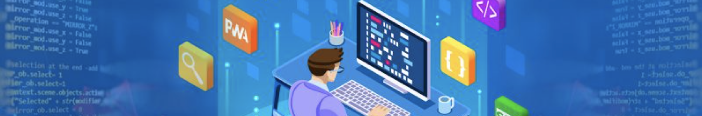

# easy-postman-utils (Make it easy postman utils)

You really want to use Postman like a pro!

This script is easy to install and easy to use.
Use case: QA Testing

# How to use it in postman

1. Go to the request you need the utility ( It also works if you set it up in a folder pre request script)
2. Add the following pre request script to load the tools

```javascript
let utils = pm.variables.get("easy-postman-utils");
if (!utils) {
  console.log("Loading utils");
  pm.sendRequest(
    "https://raw.githubusercontent.com/ariassd/easy-postman-utils/master/src/util.js",
    function (err, response) {
      postman.setEnvironmentVariable("easy-postman-utils", response.text());
      console.log("mke-utils loaded");
    }
  );
}
```

3. Load `easy-postman-utils` to access the tools

```javascript
// Load the utility
const utils = eval(pm.environment.get("easy-postman-utils"))().utils;

// eg: generate a random string with 200 characters
var description = utils.randomStr(200);

// print the result in console
console.log(missionDescription);
```

# Available functions

1. randomStr(len, options)
2. getRandomInt(max)
3. getOneOf(arrayOfValues)
4. getRandomIntBetween(min, max)

## Stay in touch

- Author - Luis Arias 2022 <<ariassd@gmail.com>>
  [GitHub profile](https://github.com/ariassd)

## License

This software is licensed under [MIT License](LICENSE)

 

November 2022
